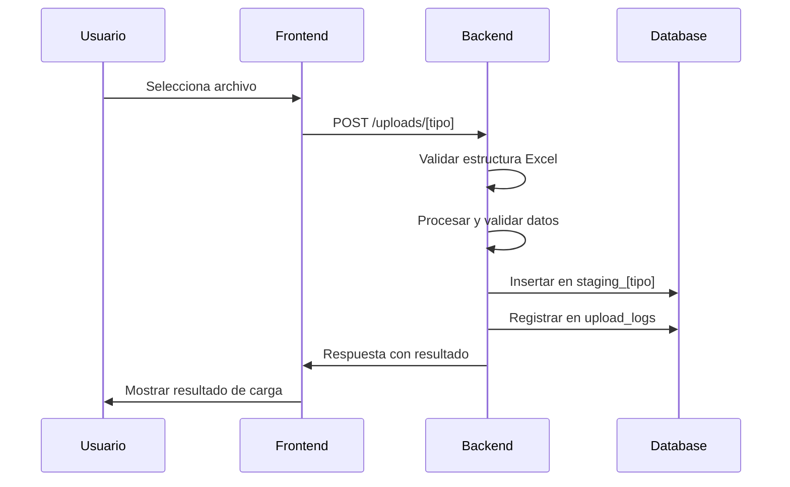
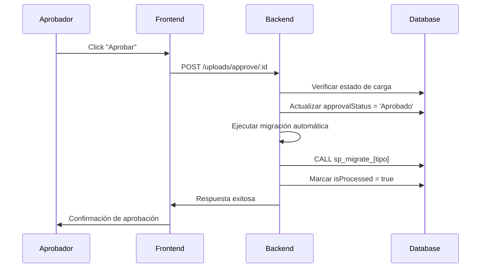
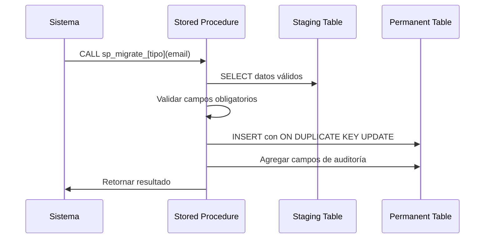

# Documentación Completa: Proceso de Aprobación de Archivos

## Tabla de Contenidos
1. [Resumen Ejecutivo](#resumen-ejecutivo)
2. [Arquitectura del Sistema](#arquitectura-del-sistema)
3. [Flujo de Datos Completo](#flujo-de-datos-completo)
4. [Implementación por Tipo de Carga](#implementación-por-tipo-de-carga)
5. [Objetos de Base de Datos](#objetos-de-base-de-datos)
6. [Endpoints de API](#endpoints-de-api)
7. [Código de Referencia](#código-de-referencia)
8. [Estrategia de Replicación](#estrategia-de-replicación)
9. [Consideraciones de Seguridad](#consideraciones-de-seguridad)
10. [Troubleshooting](#troubleshooting)

---

## Resumen Ejecutivo

El sistema de aprobación de archivos implementa un flujo completo de **carga → validación → aprobación → migración** para los tipos de datos "Vacantes Inicio" y "Reporte Cursables". Este proceso garantiza la integridad de los datos mediante validaciones robustas, auditoría completa y migración controlada a tablas permanentes.

### Características Principales
- ✅ **Validación automática** de datos en carga
- ✅ **Flujo de aprobación** con roles específicos
- ✅ **Migración automática** post-aprobación
- ✅ **Auditoría completa** de todas las operaciones
- ✅ **Manejo de duplicados** inteligente
- ✅ **Rollback** mediante preservación de datos staging

---

## Arquitectura del Sistema

### Componentes Backend (NestJS)

```
backend/src/uploads/
├── uploads.controller.ts     # Endpoints REST
├── uploads.service.ts        # Lógica de negocio
├── uploads.module.ts         # Configuración del módulo
└── entities/
    └── upload-log.entity.ts  # Entidad de auditoría
```

### Componentes Frontend (React)

```
frontend/src/features/dataUpload/
├── services/
│   └── upload.service.ts           # Cliente API
├── components/
│   └── RecentUploadsManager.tsx    # UI de gestión
└── DataUploadPage.tsx              # Página principal
```

### Base de Datos

```
Tablas Principales:
├── upload_logs                     # Registro de cargas
├── staging_vacantes_inicio         # Datos temporales
├── staging_reporte_cursables       # Datos temporales
├── vacantes_inicio_permanente      # Datos aprobados
└── reporte_cursables_aprobados     # Datos aprobados

Procedimientos Almacenados:
├── sp_migrate_staging_vacantes_inicio_to_permanente
└── sp_migrate_staging_reporte_cursables_to_permanente
```

---

## Flujo de Datos Completo

### Fase 1: Carga Inicial



**Estados después de carga:**
- `upload_logs.status`: 'Exitoso' | 'Con errores' | 'Error'
- `upload_logs.approvalStatus`: 'Pendiente'
- `upload_logs.isProcessed`: false

### Fase 2: Proceso de Aprobación



**Estados después de aprobación:**
- `upload_logs.approvalStatus`: 'Aprobado'
- `upload_logs.approvedByUserId`: ID del aprobador
- `upload_logs.approvedAt`: Timestamp
- `upload_logs.isProcessed`: true
- `upload_logs.processedAt`: Timestamp

### Fase 3: Migración de Datos



---

## Implementación por Tipo de Carga

### 1. Vacantes Inicio

#### Estructura de Datos

**Tabla Staging: `staging_vacantes_inicio`**
```sql
CREATE TABLE staging_vacantes_inicio (
    codigo_plan VARCHAR(50) NOT NULL,
    carrera VARCHAR(255) NOT NULL,
    sigla_asignatura VARCHAR(20) NOT NULL,
    asignatura VARCHAR(255) NOT NULL,
    nivel VARCHAR(50),
    creditos INT NOT NULL,
    vacantes INT NOT NULL,
    id_bimestre INT NOT NULL,
    PRIMARY KEY (codigo_plan, sigla_asignatura, id_bimestre)
);
```

**Tabla Permanente: `vacantes_inicio_permanente`**
```sql
CREATE TABLE vacantes_inicio_permanente (
    codigo_plan VARCHAR(50) NOT NULL,
    carrera VARCHAR(255) NOT NULL,
    sigla_asignatura VARCHAR(20) NOT NULL,
    asignatura VARCHAR(255) NOT NULL,
    nivel VARCHAR(50),
    creditos INT NOT NULL,
    vacantes INT NOT NULL,
    id_bimestre INT NOT NULL,
    fecha_aprobacion DATETIME NOT NULL,
    aprobado_por VARCHAR(255),
    fecha_creacion DATETIME DEFAULT CURRENT_TIMESTAMP,
    fecha_actualizacion DATETIME DEFAULT CURRENT_TIMESTAMP ON UPDATE CURRENT_TIMESTAMP,
    activo TINYINT DEFAULT 1,
    PRIMARY KEY (codigo_plan, sigla_asignatura, id_bimestre)
);
```

#### Validaciones Implementadas

```typescript
// En uploads.service.ts - validateVacantesInicioData()
const validations = {
    codigo_plan: 'Requerido, no vacío',
    carrera: 'Requerido, no vacío',
    sigla_asignatura: 'Requerido, no vacío',
    asignatura: 'Requerido, no vacío',
    creditos: 'Requerido, numérico, > 0',
    vacantes: 'Requerido, numérico, >= 0',
    id_bimestre: 'Requerido, numérico'
};
```

#### Procedimiento de Migración

```sql
CREATE PROCEDURE sp_migrate_staging_vacantes_inicio_to_permanente(
    IN p_aprobado_por VARCHAR(255)
)
BEGIN
    INSERT INTO vacantes_inicio_permanente (
        codigo_plan, carrera, sigla_asignatura, asignatura,
        nivel, creditos, vacantes, id_bimestre,
        fecha_aprobacion, aprobado_por, fecha_creacion, fecha_actualizacion, activo
    )
    SELECT
        svi.codigo_plan, svi.carrera, svi.sigla_asignatura, svi.asignatura,
        svi.nivel, svi.creditos, svi.vacantes, svi.id_bimestre,
        NOW(), COALESCE(p_aprobado_por, 'SISTEMA'), NOW(), NOW(), 1
    FROM staging_vacantes_inicio svi
    WHERE svi.codigo_plan IS NOT NULL AND svi.codigo_plan != ''
      AND svi.sigla_asignatura IS NOT NULL AND svi.sigla_asignatura != ''
      AND svi.carrera IS NOT NULL AND svi.carrera != ''
      AND svi.asignatura IS NOT NULL AND svi.asignatura != ''
      AND svi.id_bimestre IS NOT NULL
      AND svi.vacantes IS NOT NULL
      AND svi.creditos IS NOT NULL
    ON DUPLICATE KEY UPDATE
        carrera = VALUES(carrera),
        asignatura = VALUES(asignatura),
        nivel = VALUES(nivel),
        creditos = VALUES(creditos),
        vacantes = VALUES(vacantes),
        fecha_aprobacion = NOW(),
        aprobado_por = COALESCE(p_aprobado_por, 'SISTEMA'),
        fecha_actualizacion = NOW(),
        activo = 1;
END
```

### 2. Reporte Cursables

#### Estructura de Datos

**Tabla Staging: `staging_reporte_cursables`**
```sql
CREATE TABLE staging_reporte_cursables (
    id INT AUTO_INCREMENT PRIMARY KEY,
    rut VARCHAR(20),
    plan VARCHAR(50),
    nivel VARCHAR(50),
    sigla VARCHAR(50),
    asignatura VARCHAR(255),
    id_bimestre INT
);
```

**Tabla Permanente: `reporte_cursables_aprobados`**
```sql
CREATE TABLE reporte_cursables_aprobados (
    id INT AUTO_INCREMENT PRIMARY KEY,
    rut VARCHAR(20) NOT NULL,
    plan VARCHAR(50),
    nivel VARCHAR(50),
    sigla VARCHAR(50) NOT NULL,
    asignatura VARCHAR(255),
    id_bimestre INT NOT NULL,
    aprobado_por VARCHAR(255),
    fecha_aprobacion DATETIME NOT NULL,
    fecha_creacion DATETIME DEFAULT CURRENT_TIMESTAMP,
    fecha_actualizacion DATETIME DEFAULT CURRENT_TIMESTAMP ON UPDATE CURRENT_TIMESTAMP,
    UNIQUE KEY unique_cursable (rut, sigla, id_bimestre)
);
```

#### Validaciones Implementadas

```typescript
// En uploads.service.ts - validateReporteCursablesData()
const validations = {
    rut: 'Requerido, formato válido (XX.XXX.XXX-X)',
    sigla: 'Requerido, no vacío',
    id_bimestre: 'Requerido, numérico',
    plan: 'Opcional',
    nivel: 'Opcional',
    asignatura: 'Opcional'
};
```

#### Procedimiento de Migración

```sql
CREATE PROCEDURE sp_migrate_staging_reporte_cursables_to_permanente(
    IN p_aprobado_por VARCHAR(255)
)
BEGIN
    INSERT INTO reporte_cursables_aprobados (
        rut, plan, nivel, sigla, asignatura, id_bimestre,
        aprobado_por, fecha_aprobacion, fecha_creacion, fecha_actualizacion
    )
    SELECT 
        src.rut, src.plan, src.nivel, src.sigla, src.asignatura, src.id_bimestre,
        COALESCE(p_aprobado_por, 'SISTEMA'), NOW(), NOW(), NOW()
    FROM staging_reporte_cursables src
    WHERE src.rut IS NOT NULL AND src.rut != ''
      AND src.sigla IS NOT NULL AND src.sigla != ''
      AND src.id_bimestre IS NOT NULL
    ON DUPLICATE KEY UPDATE
        plan = VALUES(plan),
        nivel = VALUES(nivel),
        asignatura = VALUES(asignatura),
        fecha_aprobacion = NOW(),
        aprobado_por = COALESCE(p_aprobado_por, 'SISTEMA'),
        fecha_actualizacion = NOW();
END
```

---

## Objetos de Base de Datos

### Tabla de Auditoría Principal

```sql
CREATE TABLE upload_logs (
    id INT AUTO_INCREMENT PRIMARY KEY,
    fileName VARCHAR(255) NOT NULL,
    uploadType VARCHAR(100) NOT NULL,
    uploadDate DATETIME DEFAULT CURRENT_TIMESTAMP,
    bimestreId INT,
    status ENUM('Exitoso', 'Con errores', 'Error') NOT NULL,
    approvalStatus ENUM('Pendiente', 'Aprobado', 'Rechazado') DEFAULT 'Pendiente',
    approvedByUserId INT,
    approvedAt DATETIME,
    isProcessed BOOLEAN DEFAULT FALSE,
    processedAt DATETIME,
    totalRecords INT DEFAULT 0,
    errorCount INT DEFAULT 0,
    errorDetails TEXT,
    userId INT,
    
    INDEX idx_upload_type (uploadType),
    INDEX idx_approval_status (approvalStatus),
    INDEX idx_bimestre (bimestreId),
    INDEX idx_upload_date (uploadDate)
);
```

### Índices Recomendados

```sql
-- Para staging_vacantes_inicio
CREATE INDEX IX_staging_vacantes_inicio_bimestre ON staging_vacantes_inicio(id_bimestre);
CREATE INDEX IX_staging_vacantes_inicio_sigla ON staging_vacantes_inicio(sigla_asignatura);

-- Para staging_reporte_cursables
CREATE INDEX IX_staging_reporte_cursables_bimestre ON staging_reporte_cursables(id_bimestre);
CREATE INDEX IX_staging_reporte_cursables_rut ON staging_reporte_cursables(rut);
CREATE INDEX IX_staging_reporte_cursables_sigla ON staging_reporte_cursables(sigla);

-- Para tablas permanentes
CREATE INDEX IX_vacantes_permanente_bimestre ON vacantes_inicio_permanente(id_bimestre);
CREATE INDEX IX_vacantes_permanente_aprobacion ON vacantes_inicio_permanente(fecha_aprobacion);

CREATE INDEX IX_cursables_aprobados_bimestre ON reporte_cursables_aprobados(id_bimestre);
CREATE INDEX IX_cursables_aprobados_aprobacion ON reporte_cursables_aprobados(fecha_aprobacion);
```

---

## Endpoints de API

### Endpoints de Carga

```typescript
// POST /uploads/vacantes-inicio
{
  "file": "archivo.xlsx",
  "bimestreId": 16,
  "mode": "replace",
  "validateOnly": false
}

// POST /uploads/reporte-cursables
{
  "file": "archivo.xlsx",
  "bimestreId": 16,
  "mode": "replace",
  "validateOnly": false
}
```

### Endpoints de Aprobación

```typescript
// POST /uploads/approve/:uploadId
// Headers: Authorization: Bearer <token>
// Roles requeridos: 'Maestro'
{
  "comments": "Datos verificados correctamente" // Opcional
}

// Respuesta:
{
  "success": true,
  "message": "Carga aprobada exitosamente",
  "data": {
    "id": 123,
    "fileName": "vacantes_inicio.xlsx",
    "uploadType": "Vacantes Inicio",
    "approvalStatus": "Aprobado",
    "approvedAt": "2024-01-15T10:30:00Z"
  }
}
```

```typescript
// POST /uploads/reject/:uploadId
// Headers: Authorization: Bearer <token>
// Roles requeridos: 'Maestro'
{
  "reason": "Datos inconsistentes en columna X" // Opcional
}

// Respuesta:
{
  "success": true,
  "message": "Carga rechazada exitosamente",
  "data": {
    "id": 123,
    "fileName": "vacantes_inicio.xlsx",
    "uploadType": "Vacantes Inicio",
    "approvalStatus": "Rechazado",
    "approvedAt": "2024-01-15T10:30:00Z",
    "rejectionReason": "Datos inconsistentes en columna X"
  }
}
```

### Endpoints de Consulta

```typescript
// GET /uploads/recent?bimestreId=16
{
  "success": true,
  "data": [
    {
      "id": 123,
      "filename": "vacantes_inicio.xlsx",
      "type": "Vacantes Inicio",
      "uploadDate": "2024-01-15T09:00:00Z",
      "bimestre": "Bimestre 16",
      "status": "Exitoso",
      "approvalStatus": "Pendiente",
      "totalRecords": 150,
      "errorCount": 0,
      "userName": "usuario@ejemplo.com"
    }
  ]
}

// GET /uploads/history?page=1&limit=20&uploadType=Vacantes%20Inicio
{
  "success": true,
  "data": {
    "uploads": [...],
    "pagination": {
      "currentPage": 1,
      "totalPages": 5,
      "totalItems": 95,
      "itemsPerPage": 20
    }
  }
}

// GET /uploads/details/:uploadId
{
  "success": true,
  "data": {
    "upload": {
      "id": 123,
      "filename": "vacantes_inicio.xlsx",
      "type": "Vacantes Inicio",
      "uploadDate": "2024-01-15T09:00:00Z",
      "status": "Exitoso",
      "approvalStatus": "Aprobado"
    },
    "validRecords": [...],
    "invalidRecords": [...],
    "summary": {
      "totalRecords": 150,
      "validRecords": 148,
      "invalidRecords": 2
    }
  }
}
```

---

## Código de Referencia

### Método Principal de Aprobación

```typescript
// backend/src/uploads/uploads.service.ts
async approveUpload(uploadId: number, approvedByUserId: number) {
  try {
    this.logger.log(`=== APROBANDO CARGA ID: ${uploadId} ===`);
    
    // 1. Buscar y validar la carga
    const upload = await this.uploadLogRepository.findOne({
      where: { id: uploadId },
      relations: ['bimestre', 'user']
    });

    if (!upload) {
      throw new BadRequestException('Carga no encontrada');
    }

    if (upload.approvalStatus === 'Aprobado') {
      throw new BadRequestException('La carga ya está aprobada');
    }

    if (upload.isProcessed) {
      throw new BadRequestException('La carga ya ha sido procesada');
    }

    // 2. Actualizar estado de aprobación
    upload.approvalStatus = 'Aprobado';
    upload.approvedByUserId = approvedByUserId;
    upload.approvedAt = new Date();
    await this.uploadLogRepository.save(upload);

    // 3. Ejecutar migración según tipo de carga
    if (upload.uploadType === 'Vacantes Inicio') {
      const approverUser = await this.dataSource.query(
        'SELECT email_institucional FROM users WHERE id = ?',
        [approvedByUserId]
      );
      const approverEmail = approverUser.length > 0 ? approverUser[0].email_institucional : null;
      
      await this.migrateVacantesInicio(approverEmail);
      
      upload.isProcessed = true;
      upload.processedAt = new Date();
      await this.uploadLogRepository.save(upload);
    }
    
    if (upload.uploadType === 'Reporte Cursables') {
      const approverUser = await this.dataSource.query(
        'SELECT email_institucional FROM users WHERE id = ?',
        [approvedByUserId]
      );
      const approverEmail = approverUser.length > 0 ? approverUser[0].email_institucional : null;
      
      await this.migrateReporteCursables(approverEmail);
      
      upload.isProcessed = true;
      upload.processedAt = new Date();
      await this.uploadLogRepository.save(upload);
    }

    return {
      id: upload.id,
      fileName: upload.fileName,
      uploadType: upload.uploadType,
      approvalStatus: upload.approvalStatus,
      approvedAt: upload.approvedAt
    };
  } catch (error) {
    this.logger.error('Error al aprobar carga:', error.message);
    throw error;
  }
}
```

### Métodos de Migración

```typescript
// Migración de Vacantes Inicio
private async migrateVacantesInicio(approverEmail: string): Promise<void> {
  try {
    this.logger.log('=== INICIANDO MIGRACIÓN DE VACANTES INICIO CON SP ===');
    
    const stagingCount = await this.stagingVacantesInicioRepository.count();
    this.logger.log(`Registros en staging_vacantes_inicio: ${stagingCount}`);
    
    if (stagingCount === 0) {
      this.logger.log('No hay registros en staging_vacantes_inicio para migrar');
      return;
    }

    const currentCount = await this.dataSource.query('SELECT COUNT(*) as count FROM vacantes_inicio_permanente');
    const currentVacantesCount = currentCount[0].count;
    
    await this.dataSource.query(
      'CALL sp_migrate_staging_vacantes_inicio_to_permanente(?)',
      [approverEmail]
    );
    
    const finalCount = await this.dataSource.query('SELECT COUNT(*) as count FROM vacantes_inicio_permanente');
    const finalVacantesCount = finalCount[0].count;
    const processedRecords = finalVacantesCount - currentVacantesCount;
    
    this.logger.log(`=== MIGRACIÓN COMPLETADA: ${processedRecords} registros procesados ===`);
  } catch (error) {
    this.logger.error('Error durante la migración de vacantes inicio:', error.message);
    throw error;
  }
}

// Migración de Reporte Cursables
private async migrateReporteCursables(approverEmail: string): Promise<void> {
  try {
    this.logger.log('=== INICIANDO MIGRACIÓN DE REPORTE CURSABLES CON SP ===');
    
    const stagingCount = await this.stagingReporteCursablesRepository.count();
    this.logger.log(`Registros en staging_reporte_cursables: ${stagingCount}`);
    
    if (stagingCount === 0) {
      this.logger.log('No hay registros en staging_reporte_cursables para migrar');
      return;
    }

    const currentCount = await this.dataSource.query('SELECT COUNT(*) as count FROM reporte_cursables_aprobados');
    const currentReporteCount = currentCount[0].count;
    
    await this.dataSource.query(
      'CALL sp_migrate_staging_reporte_cursables_to_permanente(?)',
      [approverEmail]
    );
    
    const finalCount = await this.dataSource.query('SELECT COUNT(*) as count FROM reporte_cursables_aprobados');
    const finalReporteCount = finalCount[0].count;
    const processedRecords = finalReporteCount - currentReporteCount;
    
    this.logger.log(`=== MIGRACIÓN COMPLETADA: ${processedRecords} registros procesados ===`);
  } catch (error) {
    this.logger.error('Error durante la migración de reporte cursables:', error.message);
    throw error;
  }
}
```

### Controlador de Aprobación

```typescript
// backend/src/uploads/uploads.controller.ts
@Post('approve/:uploadId')
@Roles('Maestro')
async approveUpload(
  @Param('uploadId') uploadId: string,
  @User() user: any,
) {
  try {
    this.logger.log(`=== APROBANDO CARGA: ${uploadId} ===`);
    this.logger.log(`Usuario aprobador: ${user.userId}`);
    
    const result = await this.uploadService.approveUpload(
      parseInt(uploadId),
      user.userId,
    );
    
    this.logger.log('Carga aprobada exitosamente');
    return this.responseService.success(
      result,
      'Carga aprobada exitosamente'
    );
  } catch (error) {
    this.logger.error('=== ERROR AL APROBAR CARGA ===');
    this.logger.error('Error:', error.message);
    
    return this.responseService.error(
      'Error al aprobar la carga',
      [error.message],
    );
  }
}

@Post('reject/:uploadId')
@Roles('Maestro')
async rejectUpload(
  @Param('uploadId') uploadId: string,
  @Body() body: { reason?: string },
  @User() user: any,
) {
  try {
    this.logger.log(`=== RECHAZANDO CARGA: ${uploadId} ===`);
    this.logger.log(`Usuario que rechaza: ${user.userId}`);
    this.logger.log(`Razón: ${body.reason || 'No especificada'}`);
    
    const result = await this.uploadService.rejectUpload(
      parseInt(uploadId),
      user.userId,
      body.reason,
    );
    
    this.logger.log('Carga rechazada exitosamente');
    return this.responseService.success(
      result,
      'Carga rechazada exitosamente'
    );
  } catch (error) {
    this.logger.error('=== ERROR AL RECHAZAR CARGA ===');
    this.logger.error('Error:', error.message);
    
    return this.responseService.error(
      'Error al rechazar la carga',
      [error.message],
    );
  }
}
```

### Cliente Frontend

```typescript
// frontend/src/features/dataUpload/services/upload.service.ts
export const uploadService = {
  async approveUpload(uploadId: number, comments?: string): Promise<{ success: boolean; message: string }> {
    try {
      const response = await apiClient.post(`/uploads/approve/${uploadId}`, {
        comments
      });
      return {
        success: response.data.success,
        message: response.data.message
      };
    } catch (error: any) {
      console.error('Approve upload error:', error);
      throw new Error(error.response?.data?.message || 'Error al aprobar la carga');
    }
  },

  async rejectUpload(uploadId: number, comments?: string): Promise<{ success: boolean; message: string }> {
    try {
      const response = await apiClient.post(`/uploads/reject/${uploadId}`, {
        comments
      });
      return {
        success: response.data.success,
        message: response.data.message
      };
    } catch (error: any) {
      console.error('Reject upload error:', error);
      throw new Error(error.response?.data?.message || 'Error al rechazar la carga');
    }
  }
};
```

---

## Estrategia de Replicación

### Pasos para Implementar un Nuevo Tipo de Carga

#### 1. Crear Entidades y Tablas

```typescript
// 1.1 Crear entidad staging
// backend/src/[nuevo-tipo]/entities/[nuevo-tipo].entity.ts
import { Entity, Column, Index } from 'typeorm';

@Entity('staging_[nuevo_tipo]')
@Index('IX_staging_[nuevo_tipo]_bimestre', ['id_bimestre'])
export class Staging[NuevoTipo] {
  @Column({ type: 'varchar', length: 50, primary: true })
  campo_clave: string;

  @Column({ type: 'varchar', length: 255 })
  campo_requerido: string;

  @Column({ type: 'int', nullable: true })
  campo_opcional: number;

  @Column({ type: 'int', primary: true })
  id_bimestre: number;
}
```

```sql
-- 1.2 Crear tabla permanente
CREATE TABLE [nuevo_tipo]_aprobados (
    id INT AUTO_INCREMENT PRIMARY KEY,
    campo_clave VARCHAR(50) NOT NULL,
    campo_requerido VARCHAR(255) NOT NULL,
    campo_opcional INT,
    id_bimestre INT NOT NULL,
    
    -- Campos de auditoría estándar
    aprobado_por VARCHAR(255),
    fecha_aprobacion DATETIME NOT NULL,
    fecha_creacion DATETIME DEFAULT CURRENT_TIMESTAMP,
    fecha_actualizacion DATETIME DEFAULT CURRENT_TIMESTAMP ON UPDATE CURRENT_TIMESTAMP,
    activo TINYINT DEFAULT 1,
    
    UNIQUE KEY unique_[nuevo_tipo] (campo_clave, id_bimestre),
    INDEX idx_bimestre (id_bimestre),
    INDEX idx_aprobacion (fecha_aprobacion)
);
```

#### 2. Crear Procedimiento Almacenado

```sql
-- backend/database/migrations/XXX-create-sp-migrate-[nuevo-tipo].sql
DROP PROCEDURE IF EXISTS sp_migrate_staging_[nuevo_tipo]_to_aprobados;

DELIMITER //
CREATE PROCEDURE sp_migrate_staging_[nuevo_tipo]_to_aprobados(
    IN p_aprobado_por VARCHAR(255)
)
BEGIN
    INSERT INTO [nuevo_tipo]_aprobados (
        campo_clave,
        campo_requerido,
        campo_opcional,
        id_bimestre,
        aprobado_por,
        fecha_aprobacion,
        fecha_creacion,
        fecha_actualizacion,
        activo
    )
    SELECT
        s.campo_clave,
        s.campo_requerido,
        s.campo_opcional,
        s.id_bimestre,
        COALESCE(p_aprobado_por, 'SISTEMA'),
        NOW(),
        NOW(),
        NOW(),
        1
    FROM staging_[nuevo_tipo] s
    WHERE s.campo_clave IS NOT NULL AND s.campo_clave != ''
      AND s.campo_requerido IS NOT NULL AND s.campo_requerido != ''
      AND s.id_bimestre IS NOT NULL
    ON DUPLICATE KEY UPDATE
        campo_requerido = VALUES(campo_requerido),
        campo_opcional = VALUES(campo_opcional),
        fecha_aprobacion = NOW(),
        aprobado_por = COALESCE(p_aprobado_por, 'SISTEMA'),
        fecha_actualizacion = NOW(),
        activo = 1;
END //
DELIMITER ;
```

#### 3. Implementar Lógica de Procesamiento

```typescript
// 3.1 Agregar al uploads.service.ts

// En el constructor, agregar el repository
constructor(
  // ... otros repositories
  @InjectRepository(Staging[NuevoTipo])
  private staging[NuevoTipo]Repository: Repository<Staging[NuevoTipo]>,
  // ...
) {}

// 3.2 Implementar método de procesamiento
async process[NuevoTipo](file: Express.Multer.File, options: ProcessOptions, userId?: number): Promise<UploadResult> {
  try {
    this.logger.log(`=== PROCESANDO ARCHIVO [NUEVO_TIPO]: ${file.originalname} ===`);
    
    // Leer archivo Excel
    const workbook = XLSX.read(file.buffer, { type: 'buffer' });
    const sheetName = workbook.SheetNames[0];
    const worksheet = workbook.Sheets[sheetName];
    const data = XLSX.utils.sheet_to_json(worksheet);
    
    this.logger.log(`Registros leídos del Excel: ${data.length}`);
    
    if (data.length === 0) {
      throw new BadRequestException('El archivo está vacío o no tiene datos válidos');
    }
    
    // Validar datos
    const validation = this.validate[NuevoTipo]Data(data);
    
    if (!validation.isValid) {
      await this.logUpload(
        file.originalname,
        '[Nuevo Tipo]',
        options.bimestreId,
        'Error',
        data.length,
        validation.errors.length,
        userId,
        validation.errors.join('; ')
      );
      
      return {
        success: false,
        message: 'Errores de validación encontrados',
        errors: validation.errors,
        summary: {
          totalRecords: data.length,
          validRecords: validation.validRecords.length,
          invalidRecords: data.length - validation.validRecords.length,
          errors: validation.errors
        }
      };
    }
    
    // Limpiar datos existentes si es modo replace
    if (options.mode === 'replace') {
      await this.clear[NuevoTipo]Data(options.bimestreId);
    }
    
    // Guardar datos válidos
    const savedRecords = await this.save[NuevoTipo]Data(validation.validRecords, options.bimestreId);
    
    // Registrar en upload_logs
    await this.logUpload(
      file.originalname,
      '[Nuevo Tipo]',
      options.bimestreId,
      'Exitoso',
      data.length,
      0,
      userId
    );
    
    this.logger.log(`=== PROCESAMIENTO [NUEVO_TIPO] COMPLETADO ===`);
    
    return {
      success: true,
      message: `Archivo procesado exitosamente. ${savedRecords.length} registros guardados.`,
      summary: {
        totalRecords: data.length,
        validRecords: savedRecords.length,
        invalidRecords: 0
      }
    };
  } catch (error) {
    this.logger.error('Error procesando [nuevo_tipo]:', error.message);
    
    await this.logUpload(
      file.originalname,
      '[Nuevo Tipo]',
      options.bimestreId,
      'Error',
      0,
      1,
      userId,
      error.message
    );
    
    throw error;
  }
}

// 3.3 Implementar validaciones
private validate[NuevoTipo]Data(data: any[]): { isValid: boolean; errors: string[]; validRecords: any[] } {
  const errors: string[] = [];
  const validRecords: any[] = [];
  
  for (let i = 0; i < data.length; i++) {
    const row = data[i];
    const rowErrors: string[] = [];
    
    // Validar campo_clave
    if (!row.campo_clave || row.campo_clave.toString().trim() === '') {
      rowErrors.push(`Fila ${i + 2}: Campo clave es requerido`);
    }
    
    // Validar campo_requerido
    if (!row.campo_requerido || row.campo_requerido.toString().trim() === '') {
      rowErrors.push(`Fila ${i + 2}: Campo requerido es obligatorio`);
    }
    
    // Validar campo_opcional (si aplica)
    if (row.campo_opcional && isNaN(Number(row.campo_opcional))) {
      rowErrors.push(`Fila ${i + 2}: Campo opcional debe ser numérico`);
    }
    
    if (rowErrors.length === 0) {
      validRecords.push({
        campo_clave: row.campo_clave.toString().trim(),
        campo_requerido: row.campo_requerido.toString().trim(),
        campo_opcional: row.campo_opcional ? Number(row.campo_opcional) : null
      });
    } else {
      errors.push(...rowErrors);
    }
  }
  
  return {
    isValid: errors.length === 0,
    errors,
    validRecords
  };
}

// 3.4 Implementar guardado
private async save[NuevoTipo]Data(data: any[], bimestreId: number): Promise<Staging[NuevoTipo][]> {
  const entities = data.map(item => {
    const entity = new Staging[NuevoTipo]();
    entity.campo_clave = item.campo_clave;
    entity.campo_requerido = item.campo_requerido;
    entity.campo_opcional = item.campo_opcional;
    entity.id_bimestre = bimestreId;
    return entity;
  });
  
  return await this.staging[NuevoTipo]Repository.save(entities);
}

// 3.5 Implementar limpieza
private async clear[NuevoTipo]Data(bimestreId: number): Promise<void> {
  await this.staging[NuevoTipo]Repository.delete({ id_bimestre: bimestreId });
  this.logger.log(`Datos existentes de [nuevo_tipo] para bimestre ${bimestreId} eliminados`);
}

// 3.6 Implementar migración
private async migrate[NuevoTipo](approverEmail: string): Promise<void> {
  try {
    this.logger.log('=== INICIANDO MIGRACIÓN DE [NUEVO_TIPO] CON SP ===');
    
    const stagingCount = await this.staging[NuevoTipo]Repository.count();
    this.logger.log(`Registros en staging_[nuevo_tipo]: ${stagingCount}`);
    
    if (stagingCount === 0) {
      this.logger.log('No hay registros en staging_[nuevo_tipo] para migrar');
      return;
    }

    const currentCount = await this.dataSource.query('SELECT COUNT(*) as count FROM [nuevo_tipo]_aprobados');
    const currentRecordCount = currentCount[0].count;
    
    await this.dataSource.query(
      'CALL sp_migrate_staging_[nuevo_tipo]_to_aprobados(?)',
      [approverEmail]
    );
    
    const finalCount = await this.dataSource.query('SELECT COUNT(*) as count FROM [nuevo_tipo]_aprobados');
    const finalRecordCount = finalCount[0].count;
    const processedRecords = finalRecordCount - currentRecordCount;
    
    this.logger.log(`=== MIGRACIÓN COMPLETADA: ${processedRecords} registros procesados ===`);
  } catch (error) {
    this.logger.error('Error durante la migración de [nuevo_tipo]:', error.message);
    throw error;
  }
}
```

#### 4. Agregar al Flujo de Aprobación

```typescript
// En el método approveUpload(), agregar:
if (upload.uploadType === '[Nuevo Tipo]') {
  this.logger.log('=== EJECUTANDO MIGRACIÓN PARA [NUEVO_TIPO] ===');
  try {
    const approverUser = await this.dataSource.query(
      'SELECT email_institucional FROM users WHERE id = ?',
      [approvedByUserId]
    );
    const approverEmail = approverUser.length > 0 ? approverUser[0].email_institucional : null;
    
    await this.migrate[NuevoTipo](approverEmail);
    
    upload.isProcessed = true;
    upload.processedAt = new Date();
    await this.uploadLogRepository.save(upload);
  } catch (migrationError) {
    this.logger.error('Error durante la migración de [nuevo_tipo]:', migrationError.message);
  }
}
```

#### 5. Agregar Endpoint en Controlador

```typescript
// En uploads.controller.ts
@Post('[nuevo-tipo]')
@UseInterceptors(FileInterceptor('file'))
async upload[NuevoTipo](
  @UploadedFile() file: Express.Multer.File,
  @Body() body: any,
  @User() user: any,
) {
  try {
    const options: ProcessOptions = {
      mode: body.mode || 'replace',
      validateOnly: body.validateOnly === 'true',
      bimestreId: parseInt(body.bimestreId)
    };
    
    const result = await this.uploadService.process[NuevoTipo](file, options, user?.userId);
    
    if (result.success) {
      return this.responseService.success(result.data, result.message);
    } else {
      return this.responseService.error(result.message, result.errors);
    }
  } catch (error) {
    this.logger.error('Error en upload [nuevo_tipo]:', error.message);
    return this.responseService.error('Error al procesar el archivo', [error.message]);
  }
}
```

#### 6. Actualizar Módulo

```typescript
// En uploads.module.ts, agregar:
import { Staging[NuevoTipo] } from '../[nuevo-tipo]/entities/[nuevo-tipo].entity';

@Module({
  imports: [
    TypeOrmModule.forFeature([
      // ... otras entidades
      Staging[NuevoTipo],
    ]),
    // ...
  ],
  // ...
})
export class UploadsModule {}
```

### Checklist de Implementación

- [ ] ✅ Crear entidad staging con índices apropiados
- [ ] ✅ Crear tabla permanente con campos de auditoría
- [ ] ✅ Implementar procedimiento almacenado de migración
- [ ] ✅ Agregar repository al servicio de uploads
- [ ] ✅ Implementar método de procesamiento
- [ ] ✅ Implementar validaciones específicas
- [ ] ✅ Implementar método de migración
- [ ] ✅ Agregar lógica al flujo de aprobación
- [ ] ✅ Crear endpoint en controlador
- [ ] ✅ Actualizar módulo con nueva entidad
- [ ] ✅ Agregar al frontend (opcional)
- [ ] ✅ Crear tests unitarios
- [ ] ✅ Documentar estructura de archivo Excel esperada

---

## Consideraciones de Seguridad

### Autenticación y Autorización

```typescript
// Roles requeridos para aprobación
@Roles('Maestro')
@UseGuards(JwtAuthGuard, RolesGuard)

// Validación de token JWT
@UseGuards(JwtAuthGuard)

// Extracción de usuario del token
@User() user: any // Contiene userId, roles, etc.
```

### Validaciones de Seguridad

1. **Validación de archivos**:
   - Solo archivos Excel (.xlsx, .xls)
   - Tamaño máximo de archivo
   - Validación de estructura

2. **Validación de permisos**:
   - Solo usuarios con rol 'Maestro' pueden aprobar
   - Validación de bimestre activo
   - Verificación de estado de carga

3. **Auditoría completa**:
   - Registro de quién aprueba/rechaza
   - Timestamp de todas las operaciones
   - Preservación de datos originales en staging

### Manejo de Errores

```typescript
// Patrón de manejo de errores
try {
  // Operación principal
  const result = await this.operationMethod();
  
  // Log de éxito
  this.logger.log('Operación completada exitosamente');
  
  return result;
} catch (error) {
  // Log detallado del error
  this.logger.error('Error en operación:', error.message);
  this.logger.error('Stack trace:', error.stack);
  
  // Re-lanzar error para manejo en controlador
  throw error;
}
```

---

## Troubleshooting

### Problemas Comunes

#### 1. Error: "Carga no encontrada"
**Causa**: ID de carga inválido o carga eliminada
**Solución**: Verificar que el ID existe en `upload_logs`

```sql
SELECT * FROM upload_logs WHERE id = [uploadId];
```

#### 2. Error: "La carga ya está aprobada"
**Causa**: Intento de aprobar una carga ya aprobada
**Solución**: Verificar estado actual

```sql
SELECT approvalStatus, approvedAt FROM upload_logs WHERE id = [uploadId];
```

#### 3. Error en procedimiento almacenado
**Causa**: Datos inválidos en staging o SP no existe
**Solución**: 

```sql
-- Verificar existencia del SP
SHOW PROCEDURE STATUS WHERE Name = 'sp_migrate_staging_[tipo]_to_permanente';

-- Verificar datos en staging
SELECT COUNT(*) FROM staging_[tipo] WHERE id_bimestre = [bimestreId];

-- Verificar campos nulos
SELECT * FROM staging_[tipo] 
WHERE campo_requerido IS NULL OR campo_requerido = ''
LIMIT 10;
```

#### 4. Error: "Usuario no autorizado"
**Causa**: Usuario sin rol 'Maestro' o token inválido
**Solución**: Verificar roles del usuario

```sql
SELECT u.email_institucional, ur.role_name 
FROM users u 
JOIN user_roles ur ON u.id = ur.user_id 
WHERE u.id = [userId];
```

### Logs de Diagnóstico

```typescript
// Habilitar logs detallados
this.logger.log('=== DIAGNÓSTICO DE APROBACIÓN ===');
this.logger.log(`Upload ID: ${uploadId}`);
this.logger.log(`Usuario: ${approvedByUserId}`);
this.logger.log(`Estado actual: ${upload.approvalStatus}`);
this.logger.log(`Procesado: ${upload.isProcessed}`);
this.logger.log(`Tipo: ${upload.uploadType}`);
this.logger.log(`Bimestre: ${upload.bimestreId}`);
```

### Comandos de Verificación

```sql
-- Verificar estado de cargas recientes
SELECT 
    id, fileName, uploadType, status, approvalStatus, 
    isProcessed, uploadDate, approvedAt
FROM upload_logs 
ORDER BY uploadDate DESC 
LIMIT 10;

-- Verificar conteos en tablas
SELECT 
    'staging_vacantes_inicio' as tabla, COUNT(*) as registros
FROM staging_vacantes_inicio
UNION ALL
SELECT 
    'vacantes_inicio_permanente' as tabla, COUNT(*) as registros
FROM vacantes_inicio_permanente
UNION ALL
SELECT 
    'staging_reporte_cursables' as tabla, COUNT(*) as registros
FROM staging_reporte_cursables
UNION ALL
SELECT 
    'reporte_cursables_aprobados' as tabla, COUNT(*) as registros
FROM reporte_cursables_aprobados;

-- Verificar procedimientos almacenados
SELECT 
    ROUTINE_NAME, 
    ROUTINE_TYPE, 
    CREATED, 
    LAST_ALTERED
FROM information_schema.ROUTINES 
WHERE ROUTINE_SCHEMA = DATABASE() 
AND ROUTINE_NAME LIKE '%migrate%';
```

---

## Conclusión

Este documento proporciona una guía completa para entender, mantener y replicar el proceso de aprobación de archivos. La arquitectura implementada es escalable, segura y auditada, permitiendo agregar nuevos tipos de carga siguiendo los patrones establecidos.

### Próximos Pasos Recomendados

1. **Implementar tests automatizados** para cada tipo de carga
2. **Crear dashboard de monitoreo** para cargas y aprobaciones
3. **Implementar notificaciones** por email para aprobaciones/rechazos
4. **Agregar métricas** de rendimiento y uso
5. **Documentar estructura** de archivos Excel para usuarios finales

### Contacto y Soporte

Para dudas sobre la implementación, consultar:
- Código fuente en: `backend/src/uploads/`
- Logs del sistema en tiempo real
- Base de datos: tabla `upload_logs` para auditoría

---

*Documento generado el: 2024-01-15*  
*Versión: 1.0*  
*Autor: Sistema de Documentación Automática*