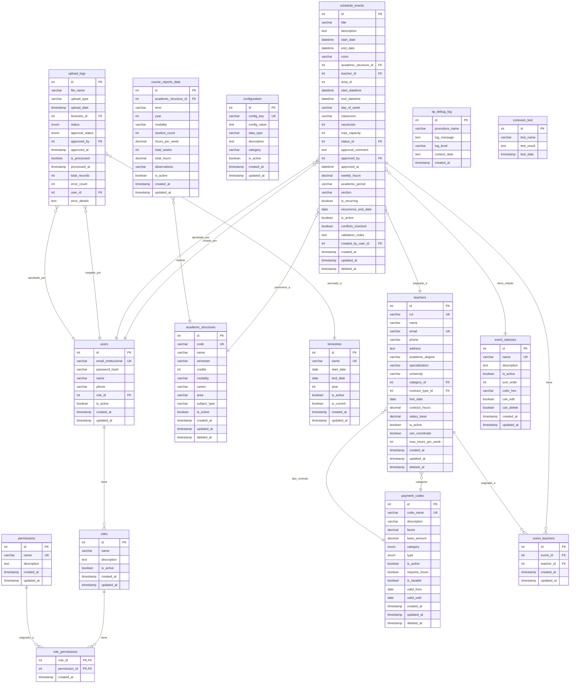

# Modelo Entidad-Relación - Sistema de Planificación Académica

## Diagrama ER en Mermaid

## Descripción de las Entidades Principales

### 1. **Gestión de Usuarios y Permisos**
- **users**: Usuarios del sistema con roles asignados
- **roles**: Roles del sistema (Administrador, Coordinador, etc.)
- **permissions**: Permisos granulares del sistema
- **role_permissions**: Tabla pivot para asignar permisos a roles

### 2. **Estructura Académica**
- **academic_structures**: Asignaturas y materias del plan de estudios
- **bimestres**: Períodos académicos (bimestres/semestres)

### 3. **Gestión de Docentes**
- **teachers**: Información personal, académica y contractual de docentes
- **payment_codes**: Códigos de pago para categorías, contratos, bonos y descuentos

### 4. **Programación Académica**
- **schedule_events**: Eventos de programación (clases, actividades)
- **event_statuses**: Estados de los eventos (Borrador, En Revisión, Aprobado, etc.)
- **event_teachers**: Relación many-to-many entre eventos y docentes

### 5. **Reportes y Datos**
- **course_reports_data**: Datos de reportes de cursos y matriculados

### 6. **Sistema y Configuración**
- **configuration**: Configuraciones del sistema
- **upload_logs**: Logs de cargas de archivos
- **sp_debug_log**: Logs de depuración de procedimientos almacenados
- **conexion_test**: Tabla para pruebas de conexión

## Características del Modelo

### Funcionalidades Principales:
1. **Gestión de Usuarios**: Sistema de roles y permisos granulares
2. **Programación Académica**: Asignación de docentes a materias con control de conflictos
3. **Gestión de Docentes**: Información completa incluyendo datos contractuales
4. **Reportes**: Generación de reportes académicos y de programación
5. **Auditoría**: Logs completos de actividades y cargas de datos

### Características Técnicas:
- **Soft Delete**: Eliminación lógica en tablas principales
- **Timestamps**: Control de creación y actualización
- **Validaciones**: Constraints y triggers para integridad de datos
- **Índices**: Optimización para consultas frecuentes
- **Procedimientos Almacenados**: Lógica de negocio en base de datos